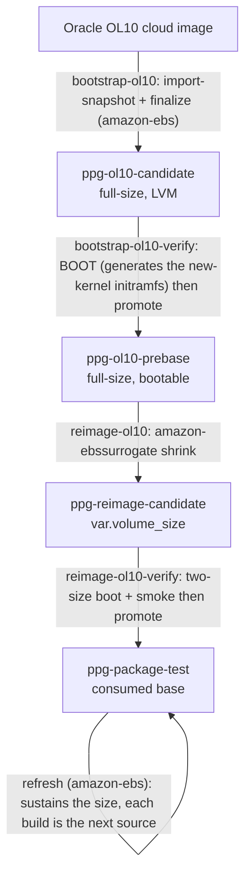
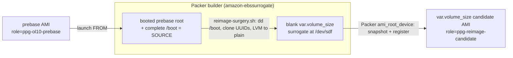

# OL10 re-image (one-time root shrink)

How the OL10 base root is shrunk to `var.volume_size`, and why each non-obvious
step is the way it is. The scripts (`scripts/reimage-ol10.sh`,
`scripts/reimage-surgery.sh`) carry only terse pointers back here.

## Why this exists

The OL10 lineage starts from Oracle's official cloud image, whose root is larger
than the `var.volume_size` (20 GiB) that OL8/OL9 use. Two AWS/filesystem limits
mean the [refresh](../README.md) path cannot shrink it on its own:

- EBS cannot restore a volume smaller than its source snapshot.
- XFS cannot shrink in place.

So a smaller root needs a one-time, file-level re-image: copy the root content
onto a fresh smaller volume, snapshot it, register a new base. OL8/OL9 never need
this because their bases are already at `var.volume_size`.

## Where it fits

The two BOOT gates are load-bearing: `bootstrap-ol10-verify` boots the full-size base
(which is when the freshly-installed kernel's initramfs is generated and `/boot` settles),
so the later shrink copies a complete, bootable `/boot`.

It is **one-time per arch**. The refresh sustains the size afterward. Re-run it
only when:

- A fresh oversized source is re-bootstrapped (FORCE rebuild, or a new Oracle image).
- `var.volume_size` is reduced further (the refresh can grow or hold a root, never shrink below the current snapshot).

## How it runs (amazon-ebssurrogate)

`reimage/reimage-ol10.pkr.hcl` is a Packer `amazon-ebssurrogate` build: it launches a builder FROM the
prebase (`source_ami_filter` role=`ppg-ol10-prebase`), attaches a blank `var.volume_size` surrogate
(`launch_block_device_mappings`), runs `scripts/reimage-surgery.sh` as a provisioner, then snapshots the
surrogate and registers the candidate AMI from it (`ami_root_device`). Packer owns the
launch / attach / snapshot / register / cleanup lifecycle, so there is no hand-rolled orchestration.

`scripts/reimage-surgery.sh` (the one provisioner) runs as root on the builder. The builder boots FROM
the **already-booted** prebase being shrunk, so its live root + complete `/boot` ARE the source; the
script locates the blank `ROOT_GIB` surrogate by size (Packer attaches it, so there is no VolumeId to
match) and reproduces the root onto it at the smaller size. No `dnf`/kernel work happens here, so the
prebase's already-generated initramfs is simply copied (this is why the shrink runs AFTER the prebase
boot-verify, not folded into finalize).

## Surgery internals

### Partition layout

Root is always the last, growable partition (cloud-init `growpart` expands it on
first boot). Offsets (MiB):

| | arm64 (UEFI) | x86_64 (BIOS) |
|---|---|---|
| p1 | ESP 1-201 | bios_grub 1-3 |
| p2 | boot 201-1225 | boot 3-1027 |
| p3 | swap 1225-5321 | swap 1027-5123 |
| p4 | root 5321-100% | root 5123-100% |

The non-root overhead (ESP/bios + boot + swap) is what `reimage-ol10-verify`
derives its post-`growpart` floor from, so the check never drifts if this table
changes.

### `/boot` is `dd`'d verbatim, not `mkfs` + copy

A fresh `mkfs.xfs` on EL10 emits an XFS on-disk format (`nrext64`) that GRUB
cannot read, leaving the firmware unable to find `/boot`. `dd` preserves the
source format and its UUID. The kernel reads any XFS, so only `/boot` (and the
ESP) must stay GRUB-readable; the root filesystem is a fresh `mkfs`.

### Cloned UUIDs

Every filesystem UUID is cloned onto the target (`mkfs.xfs -m uuid=...`,
`mkswap -U`, `mkfs.fat -i`), so `/etc/fstab` and the GRUB cmdline resolve
unchanged. The target is mounted `-o nouuid` because the source filesystem with
the same UUID is still mounted on the builder.

### LVM source -> plain-partition root (x86_64)

The x86_64 base is LVM-rooted. A second VG of the same name cannot coexist on the
builder, so root is converted to a plain partition. The GRUB cmdline and the
future-kernel seed `/etc/kernel/cmdline` are rewritten (`root=/dev/mapper/...`,
`rd.lvm.lv=...` -> `root=UUID=...`); fstab is already by UUID. `os-prober` is
disabled so `grub2-mkconfig` does not graft the builder's own root.

### Device naming

The target is a Nitro device (`/dev/nvme*`), so partitions take a `p` suffix
(`nvme1n1p2`). The suffix is derived (append `p` only when the device name ends in
a digit) so a non-NVMe device name (`/dev/sdf` -> `sdf2`) would still work.

## Fail-closed gates

Every gate refuses to produce a possibly-unbootable or wrongly-sized image:

- **/boot size guard** (`surgery`): never `dd` a source `/boot` larger than the target partition (silent truncation -> unbootable).
- **fstab-root invariant** (`surgery`): the target `/etc/fstab` root must be `UUID=<cloned>` or absent (root via cmdline). A `/dev/mapper` or bare-device pin would not resolve on the plain-partition target.
- **surviving-LVM grep** (`surgery`, x86_64): abort if any `vg_main` / `rd.lvm.lv` / `root=/dev/(mapper|dm-)` reference survives in any cmdline source, including the future-kernel seeds `/etc/kernel/cmdline` and `grubenv` (a clean immediate boot can still regress on the next kernel install otherwise).
- **root=UUID positive gate** (`surgery`, x86_64): abort unless the effective cmdline pins root by the cloned filesystem UUID.
- **size gate** (`verify`): never promote a base whose root snapshot exceeds `var.volume_size`, or the refresh could not launch it.
- **cross-env gate** (`verify`): never promote a candidate whose `factory_env` tag does not match the requested env (a test candidate can never reach the prod role by an omitted/wrong arg).
- **two-size boot + smoke** (`verify`): boot at `var.volume_size` and 30 GiB, assert `growpart` grew root, then a fresh-boot smoke (install) before promotion.

## Cleanup and recovery

Packer owns the build's instance, surrogate volume, snapshot, and AMI lifecycle,
including cleanup on failure. `reimage-surgery.sh` additionally traps EXIT to thaw
`/boot` if still frozen and unmount `/mnt/target` deepest-first, so a mid-surgery
failure leaves the builder clean for Packer's detach.

An orphaned candidate from a failed `verify` (role `ppg-reimage-candidate`, never
consumed) is reaped by `just prune-stale`.
